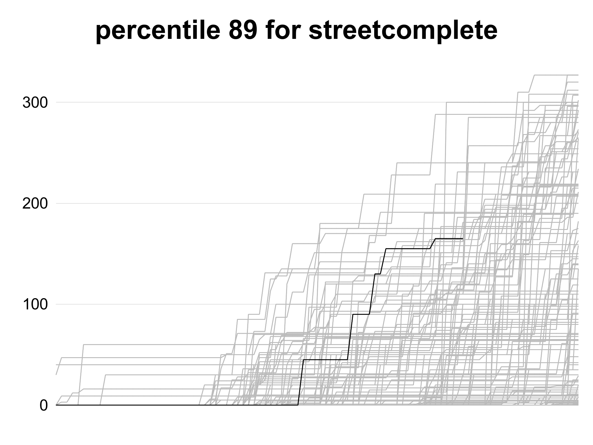

Generator of percentile feedback image for a Beemider goal.

Lines represent progress during day, with line in a special color showing progress during a current day.

Percentile N means that we are better than N% of previous attempts at a given hour of a day.

The purpose of this addition to [beeminder](http://beeminder.com/) is to encourage doing work now rather than postponing it to a later part of the day.

# Percentile feedback

Idea is stolen from [Seth Roberts](http://archives.sethroberts.net/blog/2011/05/01/percentile-feedback-and-productivity/). [This image](inspiration.png), generated by [this program](https://github.com/nslater/percentile-feedback) inspired me to start this project.

Percentile feedback graph was described by [Nick Winter](http://www.nickwinter.net/codecombat-stats) as

> "pleasant, motivating way to graph productivity while I'm working (and can still affect it)."

It shows how current day ranks compares to earlier days, with result displayed as a percentile.

# This tool

It is intended to work well for goals that track things like "time spend on X", where it is preferable to encourage early work on a goal during each day.

This script

 - downloads Beeminder data
 - separates data by a day
 - for each day generates cumulative line of hom much time was logged to beeminder

It is using [beeminder gem](https://github.com/beeminder/beeminder-gem).

# Configuration

`token.secret` file contains [personal Beeminder access token](http://api.beeminder.com/#auth). For example if your access token is `blabla123` then the file should contain solely `blabla123` text.

`goal_name.secret` contains name of goal that will be processed.

# Install

Install dependencies

`bundle install`
